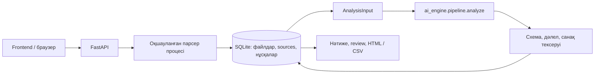

# Qurylym AI

**Ұйымдық өзгерістерді дереккөздермен тексеретін ЖИ агенті.** HackAlem AI · 404-ERROR командасы.

## 1. Жоба және дайындық күйі

Ұйымдық өзгерістерден кейін функциялардың сақталуын, ауысуын және ықтимал тәуекелдерін дәлелмен тексеруге арналған **біріктірілген прототип**. API келісімі: **1.0.0**.

FastAPI, құжат парсерлері, SQLite, AI қозғалтқышы, қазақша frontend, review және экспорт қосылған. Нақты OpenAI арқылы синтетикалық DOCX → нәтиже → дәлел → review → экспорт HTTP сценарийі өтті. Модель сынақтары мен инженерлік тексерулер бөлек көрсетіледі. Қоғамдық deployed URL әзірге жоқ; [Render нұсқаулығы](docs/RELEASE_PLAN.md) дайын.

## 2. Мәселе және пайдаланушы

Қайта ұйымдастыру кезінде міндеттің жаңа жауаптысын тек атауларға қарап анықтау қиын. Қызметкерге «бұрын кім орындады → кейін кім орындайды → қай тармақ дәлелдейді?» деген тексерілетін байланыс қажет. AI ұсынымы мен қызметкердің соңғы шешімі бөлек сақталады.

## 3. Іске асырылған мүмкіндіктер

- «Дейін» және «Кейін» топтарына бірнеше DOCX/PDF/XLSX файлын жүктеу; бір сұрау — бір файл.
- Түпнұсқа bytes, SHA-256, тұрақты source ID, контекст және құжат ішіндегі мекенді сақтау.
- Word абзацтары, кестелері, негізгі автоматты нөмірлеуі, бір абзацтағы біріктірілген тармақтар; PDF беттері; Excel парағы/ұяшығы.
- Оқылмаған графика, скан, бос тармақ, формула және ресурстық шектер туралы диагностика.
- Нұсқалар, бір белсенді талдау, idempotency, таймаут, сервер қайта қосылғаннан кейін үзілген жұмысты белгілеу.
- Нақты AI Python модуліне адаптер; Pydantic және дереккөз/санақ тексеруі.
- Сессия оқшаулауы, қызметкер шешімдерінің тарихы, қауіпсіз HTML/CSV есептері.
- Қазақша сервер беті, `/docs`, `/openapi.json`; frontend build дайын болса сол origin-нен ұсынылады.
- Бөлімшелердің сақталуы/өзгерісі, функциялардың ауысуы/ықтимал жоғалуы, қайталану және мүдделер қақтығысын AI арқылы талдау.
- Дәйексөз бен ID тексеруі, бөлек семантикалық аудит, белгісіз/ішінара қамтуды көрсету, нақты сұрау/токен есебі.
- Desktop/mobile интерфейс, дәлел панелі, қызметкер шешімі; қорғалған демо үшін `/access` арқылы кодпен кіру.

## 4. Негізгі пайдаланушы жолы

1. Сайтты ашыңыз; кіру коды орнатылса, команда берген бөлек кодпен кіріңіз.
2. «Дейін» тобына ескі, «Кейін» тобына жаңа құжаттарды жүктеңіз.
3. Оқу диагностикасын қарап, талдауды бастаңыз.
4. Құрылым, функциялар және тәуекелдер нәтижелерін қараңыз. `partial` — талдау толық емес; `unknown` — сәйкестікке дерек жеткіліксіз.
5. Қорытындыдағы дәлелді ашып, түпнұсқа тармақ пен контексті тексеріңіз.
6. Қызметкер шешімін және түсініктемені сақтаңыз.
7. HTML немесе CSV есепті жүктеп алыңыз.

API маршруттары мен сұрау мысалдары іске қосылған сервердің `/docs` бетінде және [ортақ келісімде](contracts/openapi.json) бар. Frontend-тегі арнайы demo режимі жасанды деректерді көрсетеді, нақты файлдарды талдамайды және анық белгіленеді. Нақты API қатесі демо нәтижесімен ауыстырылмайды.

Желі үзіліп, run қайта жіберілсе **сол** idempotency кілтін пайдаланыңыз. Failed жұмысты әдейі қайта бастау үшін жаңа кілт керек. 409 болса күйді жаңартыңыз. Құжат қосылса/тобы өзгерсе revision артады; ескі нәтиже жаңа нұсқаға көшірілмейді.

## 5. Технологиялар

Python 3.11+; FastAPI/Pydantic; SQLite WAL; python-docx/OOXML; pypdf; openpyxl; defusedxml; uvicorn. Біріктірілген сервер Python 3.11.9-та, AI инженерлік тесттері Python 3.12-де тексерілді; backend бастапқы жеткізілімі Python 3.14-те тексерілген. Docker Python 3.14 қолданады, контейнерлік build бөлек қабылдауды талап етеді.

Frontend: React 19, TypeScript, Vite 8, Tailwind CSS, AJV; Node 22.12+. AI: OpenAI Responses (`gpt-4.1`, strict JSON Schema), қажет болса NVIDIA embeddings. Нұсқалар `backend/requirements*.txt`, `ai_engine/requirements*.txt` және `frontend/package-lock.json` ішінде бекітілген.

Файл жүктеу және парсинг үшін [FastAPI](https://fastapi.tiangolo.com/tutorial/request-files/), [pypdf](https://pypdf.readthedocs.io/en/stable/user/extract-text.html), [openpyxl](https://openpyxl.readthedocs.io/en/stable/) құжаттары пайдаланылды.

## 6. Архитектура және біріктіру



`backend/app/main.py` — HTTP; `parsers.py` — оқу; `storage.py` — транзакциялар; `workers.py` — жеке процестер; `validation.py` — AI шекарасы; `exports.py` — есеп. Бір `DATA_DIR` үшін тек **бір worker**: файл құлпы екінші серверді тоқтатады. SQLite транзакциясы бүкіл серверде бір active job болуын қорғайды. Құжат/AI жұмысы API оқиғалар циклінен тыс орындалады.

AI модулінің public интерфейсі:

```python
async def analyze(payload: dict, emit_progress=None) -> dict:
    # AnalysisInput -> AnalysisResult; ProgressEvent callback is async.
    ...
```

Frontend иесі `frontend/package.json`, `package-lock.json` және `npm run build` → `frontend/dist` ұсынады. Бөлек dev серверде `credentials: 'include'`, бірдей hostname (`localhost` пен `127.0.0.1` араластырмаңыз) және Vite `/api` proxy қолданыңыз. Қажет болса `CORS_ORIGINS=http://localhost:5173` орнатыңыз. [Интеграция ескертпелері](coordination/requests/backend.md).

## 7. Орнату және іске қосу

Командаларды **репозиторий түбінде** орындаңыз. Windows PowerShell:

```powershell
python -m venv backend\.venv
backend\.venv\Scripts\python -m pip install --upgrade pip==26.2.1
backend\.venv\Scripts\python -m pip install -r backend/requirements-dev.txt -r ai_engine/requirements.txt
npm.cmd ci --prefix frontend
npm.cmd run build --prefix frontend
if (-not (Test-Path -LiteralPath .env)) { Copy-Item .env.example .env }
backend\.venv\Scripts\python -m uvicorn backend.app.main:app --host 127.0.0.1 --port 8000 --workers 1 --env-file .env
```

Серверді іске қоспас бұрын `.env` ішіндегі `OPENAI_API_KEY` мәнін енгізіңіз; `OPENAI_MODEL=gpt-4.1`. Жария демода `APP_ACCESS_TOKEN` үшін бөлек кездейсоқ код орнатыңыз. [Кілттерді баптау](ai_engine/API_SETUP.md). Кейін іске қосу: `backend\.venv\Scripts\python -m backend.scripts.start`. Бет: **http://127.0.0.1:8000**, API: **http://127.0.0.1:8000/docs**.

Linux/macOS:

```bash
python3 -m venv backend/.venv
backend/.venv/bin/python -m pip install --upgrade pip==26.2.1
backend/.venv/bin/python -m pip install -r backend/requirements-dev.txt -r ai_engine/requirements.txt
npm ci --prefix frontend
npm run build --prefix frontend
cp -n .env.example .env
backend/.venv/bin/python -m uvicorn backend.app.main:app --host 127.0.0.1 --port 8000 --workers 1 --env-file .env
```

AI қосылғаннан кейін тәуелділіктерді **бір resolver сұрауымен** біріктіріңіз:

```powershell
backend\.venv\Scripts\python -m pip install -r backend/requirements.txt -r ai_engine/requirements.txt
backend\.venv\Scripts\python -m pip check
```

Docker Compose v2:

```bash
docker compose up --build
```

Docker frontend бар болса оны құрады, AI requirements бар болса backend-пен бірге орнатады. Жоқ болса бэкендтің бастапқы беті ашылады, run `engine_unavailable` қайтарады. Контейнер root емес пайдаланушымен орындалады; порт әдепкіде тек localhost-қа байланған. Бұл компьютерде Docker жоқ: build/контейнерлік іске қосу орындалмады.

## 8. Конфигурация және бақылау

| Айнымалы | Мақсаты |
|---|---|
| `OPENAI_API_KEY`, `OPENAI_MODEL` | AI қатысушысы басқаратын провайдер конфигурациясы |
| `NVIDIA_API_KEY`, `NVIDIA_EMBED_MODEL`, `NVIDIA_ENABLED` | Embeddings конфигурациясы |
| `ANALYSIS_TIMEOUT_SECONDS` | Біріктірілген `.env.example` және Render: 900 с; бапталмаған backend: 300 с |
| `AI_MAX_REQUESTS`, `AI_CONCURRENCY` | Бір талдау: 300 сұрау әрекеті, бір мезгілде 3 шақыру |
| `AI_MAX_RISK_PAIRS` | Әр нұсқада 200 кандидат жұп; артық жұптар болса `partial` және `RISK_SEARCH_LIMIT` |
| `DATA_DIR` | DB/түпнұсқа/review; әдепкі `backend/data` |
| `APP_ACCESS_TOKEN` | Қазылардың `/access` бетіне енгізетін бөлек коды; API үшін Bearer де қолданылады |
| `COOKIE_SECURE` | HTTPS артында `true`; localhost HTTP үшін `false` |
| `CORS_ORIGINS` | Бөлек dev origin-дер, үтірмен; `*` қабылданбайды |

`/api/health` DB қолжетімділігін және кілттердің бар-жоғын тексереді; кілттің жарамдылығын/кредитті тексермейді. Кезең мен қателер analysis state-те, jobs тарихы SQLite-те сақталады. Provider traceback/құпия жауап клиентке шықпайды. `.env`, DB, нақты құжаттар Git-ке және Docker build контекстіне кірмейді.

## 9. Деректер, қауіпсіздік және шектер

20 МБ/файл; 10 файл/analysis; 500 000 таңба/файл; 20 000 үзінді; PDF 500 бет; XLSX 20 000 жол/256 баған/парақ. ZIP/XML қорғанысы және 45 с парсер таймауты бар. Бұл ресурстық шектер модель сапасының өлшенген шегі емес. Артық бөлік үнсіз кесілмейді: диагностика және partial/failed күйі беріледі.

Әр session cookie — кездейсоқ 256-bit токен, DB-де хэші сақталады. Дереккөз/түпнұсқа/review/export analysis пен session бойынша тексеріледі. Түпнұсқа SQLite BLOB ретінде өзгеріссіз сақталады. Құжаттар автоматты жойылмайды; осы MVP-де retention/пайдаланушыларды басқару жоқ. Нақты ортада қолжетімділікті шектеңіз, HTTPS және қорғалған сақтауды қолданыңыз. Windows-та process timeout бар; Linux контейнерінде қосымша жад шегі бар.

Репозиторийде тек **жасанды** [бақылау құжаттары](backend/tests/fixtures) бар. Үлгілерді қайта құру: `backend\.venv\Scripts\python backend/scripts/make_fixtures.py`. Түпнұсқа №8/№9 құжаттары жергілікті парсермен тексерілді: әрқайсысы 496 үзінді; №8-де бос тармақ туралы диагностика бар. Түпнұсқалар Git-ке жарияланбаған.

## 10. Тесттер және қабылдау

**Қазылардың алғашқы тексеруі:** қазақша [before.docx](backend/tests/fixtures/judge/before.docx) файлын «Дейін», [after.docx](backend/tests/fixtures/judge/after.docx) файлын «Кейін» тобына жүктеңіз. Бұл — жасанды бақылау құжаттары; олардың [күтілетін өзгерістері](backend/tests/fixtures/judge/README.md) бөлек берілген.

| Тексеру | Күтілетін нәтиже және дәлел |
|---|---|
| Құрылым | Құжат айналымы → Ақпаратты басқару: кейінгі §1.1; Сапа сақталады, Құжаттарды сақтау құрылады: §1.2 |
| Сақталған функция | Келісімшарттарды тіркеу: бұрынғы §2.1 → кейінгі §2.1 |
| Ықтимал жоғалу | Апталық резервтік көшірме тексеруі: бұрынғы §2.2; кейінгі жиында берілмеген |
| Ықтимал қайталану | Бір мұрағатта сақтау екі бөлімге жүктелген: кейінгі §2.2 және §4.1 |
| Тексерілетін қорытынды | Дәлел панелі → түпнұсқа → қызметкер шешімі → HTML/CSV экспорт |

Нақты HTTP тексеруі:

```powershell
backend\.venv\Scripts\python -m backend.scripts.smoke --require-engine --fixture-set judge
```

Қосымша қарапайым ауысу мысалы: [before.docx](backend/tests/fixtures/before.docx) және [after.docx](backend/tests/fixtures/after.docx). Жоғалу қорытындысы тек жүктелген құжаттар жиынына қатысты.

Қайта атау, бөліну/бірігу, қайталану, қайшылық, әртүрлі ауқым және тыйым үшін бөлек 15 бақылау сценарийі бар. Олардың күтілетін жауаптары модельге жіберілмейді. **[Нақты тексеру есебі](docs/VERIFICATION.md)** инженерлік нәтиже мен модель сапасын бөлек көрсетеді.

```powershell
backend\.venv\Scripts\python -m backend.scripts.verify
backend\.venv\Scripts\python -m pytest backend/tests -q -W error
backend\.venv\Scripts\python -m pip_audit --cache-dir backend/test-results/audit-cache
# Сервер бөлек терминалда жұмыс істеп тұрған кезде:
backend\.venv\Scripts\python -m backend.scripts.smoke
# Нақты AI қосылғаннан кейін міндетті толық интеграция:
backend\.venv\Scripts\python -m backend.scripts.smoke --require-engine
```

Нақты нәтижелер [coordination/backend.md](coordination/backend.md) ішінде. Тесттер API келісімі, DOCX/PDF/XLSX, транзакциялар, қатар келген run, restart recovery, сессия оқшаулауы, дәлел/санақ тексеруі, HTML escape және CSV формула қорғанысын қамтиды. Fake engine **тек тесттерде** бар; бұл тесттер AI мағыналық сапасын дәлелдемейді. `--require-engine` жоқ қозғалтқышты қабылдамайды.

## 11. Шектеулер және тапсыру

OCR/SmartArt, суреттегі ұйым құрылымы, DOC/XLS конвертациясы, күрделі Word field/restart нөмірлеудің барлық түрі, нақты бенчмаркинг қамтылмаған. Графика және аяқталмаған парсинг ашық көрсетіледі. Құжаттағы дата/түрі — эвристикалық metadata; құқықтық басымдық емес. Дәлел ID-сының дұрыстығы қорытындының мағынасын автоматты растамайды.

Түзетулерден кейін `qurylym-1.0.7` толық live жиынында 15/15 өтті (87 API шақыруы, 140.3 с). Алдыңғы сәтсіз қайталаулар тексеру тарихында сақталған; шағын бақылау жиыны жалпы дәлдік кепілдігі емес. Көлемді №8/№9 талдауы 900 с уақыт шегіне тірелді. Бұл ақаулар мен қайта тексеру нәтижелері [тексеру есебінде](docs/VERIFICATION.md) ашық көрсетілген. Frontend-тің 31 unit/API, 30 имитацияланған браузер сценарийі, backend-пен нақты HTTP және браузер сценарийі өтті. [Ортақ қабылдау және жариялау жоспары](docs/RELEASE_PLAN.md) қалған қадамдарды сипаттайды. Нақты deployed сілтеме жариялау тексерілгеннен кейін осы бөлімге қосылады. [Қорғау мәтіні және соңғы тапсыру](docs/SUBMISSION.md).
