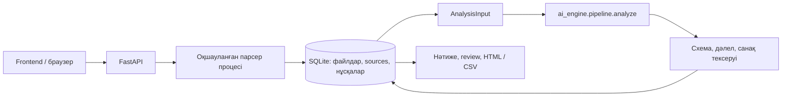

# Qurylym AI

Hackathon team repository for Bek — `BAITC-Hacks/hack-316738af-bek`.

## 1. Жоба және дайындық күйі

Ұйымдық өзгерістерден кейін функциялардың сақталуын, ауысуын және ықтимал тәуекелдерін дәлелмен тексеруге арналған жоба. Осы жеткізілім — **backend бөлігі**. API келісімі: **1.0.0**.

FastAPI, құжат парсерлері, SQLite, AI адаптері, review және экспорт іске асырылған. AI қозғалтқышы (`ai_engine/`) мен frontend (`frontend/`) — басқа екі қатысушының бөлігі; олар ортақ main тармағына енгізілген. Backend сол API келісіміне қосылады. AI модулі бөлек көшірмеде жоқ болса, сервер жасанды қорытынды қайтармайды. Қоғамдық deployed URL жоқ.

## 2. Мәселе және пайдаланушы

Қайта ұйымдастыру кезінде міндеттің жаңа жауаптысын тек атауларға қарап анықтау қиын. Қызметкерге «бұрын кім орындады → кейін кім орындайды → қай тармақ дәлелдейді?» деген тексерілетін байланыс қажет. AI ұсынымы мен қызметкердің соңғы шешімі бөлек сақталады.

## 3. Іске асырылған мүмкіндіктер

- «Дейін» және «Кейін» топтарына бірнеше DOCX/PDF/XLSX файлын жүктеу; бір сұрау — бір файл.
- Түпнұсқа bytes, SHA-256, тұрақты source ID, контекст және құжат ішіндегі мекенді сақтау.
- Word абзацтары, кестелері, негізгі автоматты нөмірлеуі, бір абзацтағы біріктірілген тармақтар; PDF беттері; Excel парағы/ұяшығы.
- Оқылмаған графика, скан, бос тармақ, формула және ресурстық шектер туралы диагностика.
- Нұсқалар, бір белсенді талдау, idempotency, таймаут, сервер қайта қосылғаннан кейін үзілген жұмысты белгілеу.
- Нақты AI Python модуліне адаптер; Pydantic және дереккөз/санақ тексеруі.
- Сессия оқшаулауы, қызметкер шешімдерінің тарихы, қауіпсіз HTML/CSV есептері.
- Қазақша сервер беті, `/docs`, `/openapi.json`; frontend build дайын болса сол origin-нен ұсынылады.

## 4. Негізгі пайдаланушы жолы

1. `POST /api/analyses` → session cookie және `analysis_id`.
2. `POST /api/analyses/{id}/documents` → multipart `version=before|after`, `file`.
3. `POST /api/analyses/{id}/run` → `{"expected_revision": N}` және жаңа UUID `Idempotency-Key`.
4. `GET /api/analyses/{id}` → прогресс; аяқталған соң `GET .../results`.
5. `GET .../sources/{span_id}` → түпнұсқа және контекст; `GET .../documents/{document_id}/download` → файл.
6. `PATCH .../findings/{finding_id}` → `analysis_revision`, `review_status`, `note`.
7. `GET .../export?format=html` немесе `csv` → есеп.

Желі үзіліп, run қайта жіберілсе **сол** idempotency кілтін пайдаланыңыз. Failed жұмысты әдейі қайта бастау үшін жаңа кілт керек. 409 болса күйді жаңартыңыз. Құжат қосылса/тобы өзгерсе revision артады; ескі нәтиже жаңа нұсқаға көшірілмейді.

## 5. Технологиялар

Python 3.14; FastAPI/Pydantic; SQLite WAL; python-docx/OOXML; pypdf; openpyxl; defusedxml; uvicorn. Дәл тексерілген нұсқалар [backend/requirements.txt](backend/requirements.txt) және [backend/requirements-dev.txt](backend/requirements-dev.txt) файлдарында бекітілген. Python 3.12/3.13 бөлек тексерілген жоқ.

Файл жүктеу және парсинг үшін [FastAPI](https://fastapi.tiangolo.com/tutorial/request-files/), [pypdf](https://pypdf.readthedocs.io/en/stable/user/extract-text.html), [openpyxl](https://openpyxl.readthedocs.io/en/stable/) құжаттары пайдаланылды.

## 6. Архитектура және біріктіру



`backend/app/main.py` — HTTP; `parsers.py` — оқу; `storage.py` — транзакциялар; `workers.py` — жеке процестер; `validation.py` — AI шекарасы; `exports.py` — есеп. Бір `DATA_DIR` үшін тек **бір worker**: файл құлпы екінші серверді тоқтатады. SQLite транзакциясы бүкіл серверде бір active job болуын қорғайды. Құжат/AI жұмысы API оқиғалар циклінен тыс орындалады.

AI иесі репозиторий түбіне `ai_engine/` және `requirements.txt` қосады:

```python
async def analyze(payload: dict, emit_progress=None) -> dict:
    # AnalysisInput -> AnalysisResult; ProgressEvent callback is async.
    ...
```

Frontend иесі `frontend/package.json`, `package-lock.json` және `npm run build` → `frontend/dist` ұсынады. Бөлек dev серверде `credentials: 'include'`, бірдей hostname (`localhost` пен `127.0.0.1` араластырмаңыз) және Vite `/api` proxy қолданыңыз. Қажет болса `CORS_ORIGINS=http://localhost:5173` орнатыңыз. [Интеграция ескертпелері](coordination/requests/backend.md).

## 7. Орнату және іске қосу

Командаларды **репозиторий түбінде** орындаңыз. Windows PowerShell:

```powershell
python -m venv backend\.venv
backend\.venv\Scripts\python -m pip install --upgrade pip==26.2.1
backend\.venv\Scripts\python -m pip install -r backend/requirements-dev.txt
Copy-Item .env.example .env
backend\.venv\Scripts\python -m uvicorn backend.app.main:app --host 127.0.0.1 --port 8000 --workers 1 --env-file .env
```

`.env` бұрын бар болса, көшіріп үстінен жазбаңыз. Кейін іске қосу: `backend\.venv\Scripts\python -m backend.scripts.start`. Бет: **http://127.0.0.1:8000**, API: **http://127.0.0.1:8000/docs**.

Linux/macOS:

```bash
python3.14 -m venv backend/.venv
backend/.venv/bin/python -m pip install --upgrade pip==26.2.1
backend/.venv/bin/python -m pip install -r backend/requirements-dev.txt
cp -n .env.example .env
backend/.venv/bin/python -m uvicorn backend.app.main:app --host 127.0.0.1 --port 8000 --workers 1 --env-file .env
```

AI қосылғаннан кейін тәуелділіктерді **бір resolver сұрауымен** біріктіріңіз:

```powershell
backend\.venv\Scripts\python -m pip install -r backend/requirements.txt -r ai_engine/requirements.txt
backend\.venv\Scripts\python -m pip check
```

Docker Compose v2:

```bash
docker compose up --build
```

Docker frontend бар болса оны құрады, AI requirements бар болса backend-пен бірге орнатады. Жоқ болса бэкендтің бастапқы беті ашылады, run `engine_unavailable` қайтарады. Контейнер root емес пайдаланушымен орындалады; порт әдепкіде тек localhost-қа байланған. Бұл компьютерде Docker жоқ: build/контейнерлік іске қосу орындалмады.

## 8. Конфигурация және бақылау

| Айнымалы | Мақсаты |
|---|---|
| `OPENAI_API_KEY`, `OPENAI_MODEL` | AI қатысушысы басқаратын провайдер конфигурациясы |
| `NVIDIA_API_KEY`, `NVIDIA_EMBED_MODEL`, `NVIDIA_ENABLED` | Embeddings конфигурациясы |
| `ANALYSIS_TIMEOUT_SECONDS` | Жалпы AI процесіне уақыт шегі, әдепкі 300 с |
| `DATA_DIR` | DB/түпнұсқа/review; әдепкі `backend/data` |
| `APP_ACCESS_TOKEN` | Қорғалған орта үшін `Authorization: Bearer ...` |
| `COOKIE_SECURE` | HTTPS артында `true`; localhost HTTP үшін `false` |
| `CORS_ORIGINS` | Бөлек dev origin-дер, үтірмен; `*` қабылданбайды |

`/api/health` DB қолжетімділігін және кілттердің бар-жоғын тексереді; кілттің жарамдылығын/кредитті тексермейді. Кезең мен қателер analysis state-те, jobs тарихы SQLite-те сақталады. Provider traceback/құпия жауап клиентке шықпайды. `.env`, DB, нақты құжаттар Git-ке және Docker build контекстіне кірмейді.

## 9. Деректер, қауіпсіздік және шектер

20 МБ/файл; 10 файл/analysis; 500 000 таңба/файл; 20 000 үзінді; PDF 500 бет; XLSX 20 000 жол/256 баған/парақ. ZIP/XML қорғанысы және 45 с парсер таймауты бар. Бұл ресурстық шектер модель сапасының өлшенген шегі емес. Артық бөлік үнсіз кесілмейді: диагностика және partial/failed күйі беріледі.

Әр session cookie — кездейсоқ 256-bit токен, DB-де хэші сақталады. Дереккөз/түпнұсқа/review/export analysis пен session бойынша тексеріледі. Түпнұсқа SQLite BLOB ретінде өзгеріссіз сақталады. Құжаттар автоматты жойылмайды; осы MVP-де retention/пайдаланушыларды басқару жоқ. Нақты ортада қолжетімділікті шектеңіз, HTTPS және қорғалған сақтауды қолданыңыз. Windows-та process timeout бар; Linux контейнерінде қосымша жад шегі бар.

Репозиторийде тек **жасанды** [бақылау құжаттары](backend/tests/fixtures) бар. Үлгілерді қайта құру: `backend\.venv\Scripts\python backend/scripts/make_fixtures.py`. Түпнұсқа №8/№9 құжаттары берілмеген және жарияланбаған.

## 10. Тесттер және қабылдау

```powershell
backend\.venv\Scripts\python -m backend.scripts.verify
backend\.venv\Scripts\python -m pytest backend/tests -q -W error
backend\.venv\Scripts\python -m pip_audit --cache-dir backend/test-results/audit-cache
# Сервер бөлек терминалда жұмыс істеп тұрған кезде:
backend\.venv\Scripts\python -m backend.scripts.smoke
# Нақты AI қосылғаннан кейін міндетті толық интеграция:
backend\.venv\Scripts\python -m backend.scripts.smoke --require-engine
```

Нақты нәтижелер [coordination/backend.md](coordination/backend.md) ішінде. Тесттер API келісімі, DOCX/PDF/XLSX, транзакциялар, қатар келген run, restart recovery, сессия оқшаулауы, дәлел/санақ тексеруі, HTML escape және CSV формула қорғанысын қамтиды. Fake engine **тек тесттерде** бар; бұл тесттер AI мағыналық сапасын дәлелдемейді. `--require-engine` жоқ қозғалтқышты қабылдамайды.

## 11. Шектеулер және тапсыру

OCR/SmartArt, суреттегі ұйым құрылымы, DOC/XLS конвертациясы, күрделі Word field/restart нөмірлеудің барлық түрі, нақты бенчмаркинг қамтылмаған. Графика және аяқталмаған парсинг ашық көрсетіледі. Құжаттағы дата/түрі — эвристикалық metadata; құқықтық басымдық емес. Дәлел ID-сының дұрыстығы қорытындының мағынасын автоматты растамайды.

Нақты API кілттері және түпнұсқа құжаттармен толық өнімнің live сценарийін бөлек тексеру қажет. Визуалды браузер QA орындалмады. Backend жұмыс тармағы — `team/backend`; біріктіру негізі — main commit `768f483d17242f8b004d091a299177899936bcb6`. [Тапсыру нұсқаулығы](backend/HANDOFF.md) қайта орнату мен интеграцияны сипаттайды. Бірінші орын немесе абсолютті қатесіздік туралы кепіл берілмейді.
