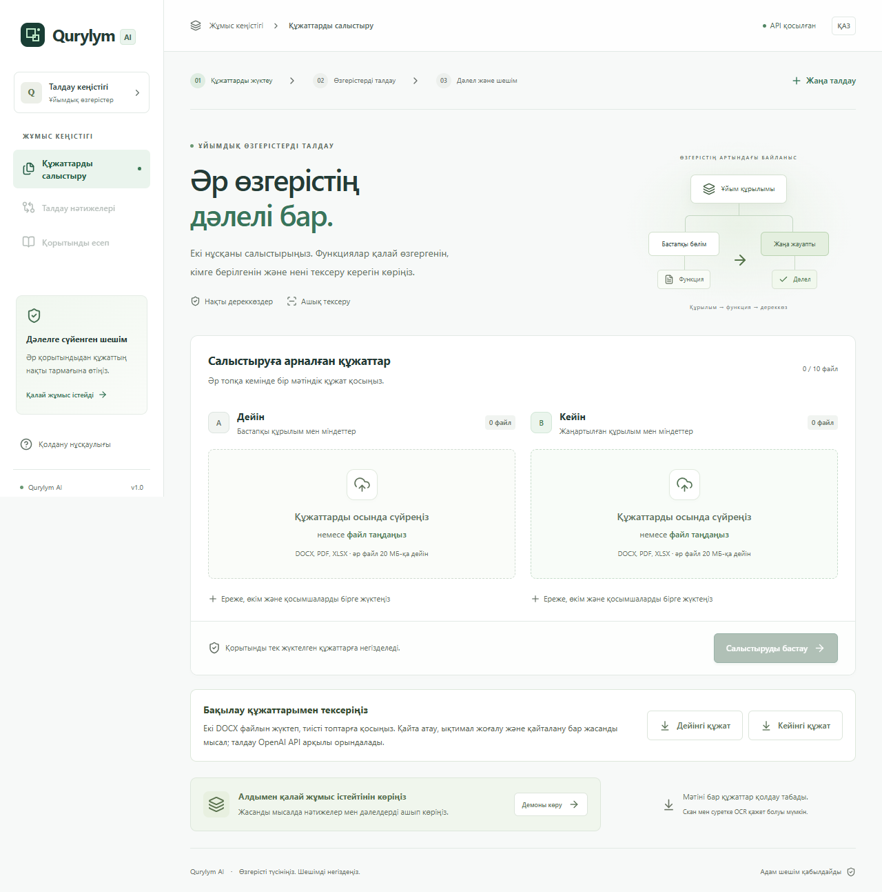
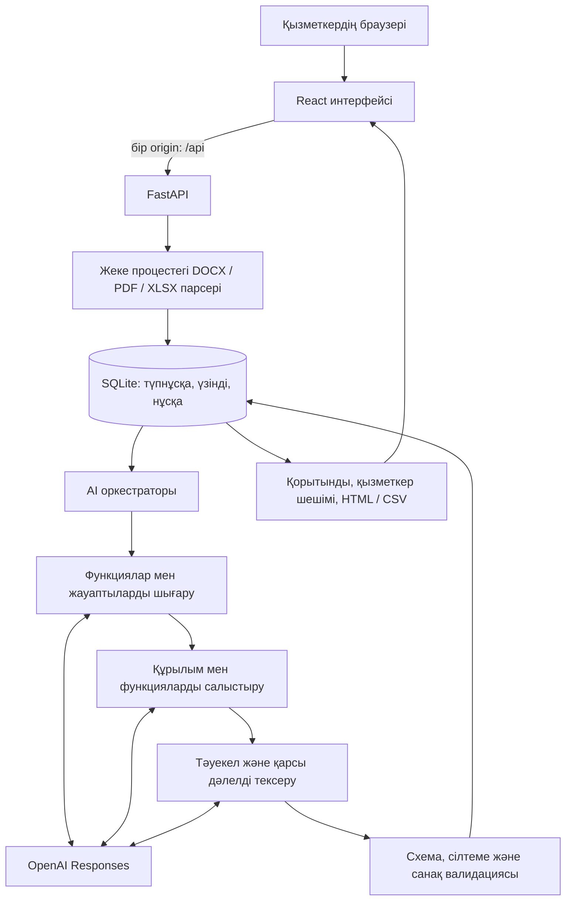

# Qurylym AI

### Әр өзгерістің дәлелі бар.

**Ұйымдық құрылым мен функционалды талдауға арналған ЖИ агенті** · HackAlem AI

**404-ERROR командасы:** Бердібек Мейірбек · Сабыр Аслан · Алхамқайыр Бекзат

[Қазыларға арналған тексеру](#8-қазыларға-арналған-тексеру) · [Іске қосу](#7-орнату-және-іске-қосу) · [Тест нәтижелері](docs/VERIFICATION.md) · [Render](#11-render-де-жариялау)



## Қазыларға жылдам бастау

**1. API кілтінсіз интерфейсті көру:** төмендегі командалардан кейін http://127.0.0.1:5173/?demo=1 адресін ашыңыз. Дайын жасанды мысалда дәлелді ашу, қызметкер шешімін сақтау және есеп экспорттау қолжетімді. Бұл режим жаңа құжаттарды талдамайды және OpenAI кредитін жұмсамайды.

```bash
npm ci --prefix frontend
npm run dev --prefix frontend
```

**2. Нақты AI талдауы:** [орнату қадамдарын](#7-орнату-және-іске-қосу) орындап, сервердегі `.env` файлына өз `OPENAI_API_KEY` кілтіңізді енгізіңіз. http://127.0.0.1:8000 адресінде **«Бақылау құжаттарымен тексеріңіз»** бөлімінен екі DOCX файлын жүктеп, «Дейін» және «Кейін» топтарына қосыңыз. Күтілетін өзгерістер [§8-де](#8-қазыларға-арналған-тексеру) көрсетілген.

**3. Автоматты бағалау:** §8-дегі инженерлік тесттер мен `evaluation.check` командасы API кілтінсіз орындалады. `--live` және `smoke --require-engine` командалары нақты API кредитін жұмсайды. Демо нәтижелері нақты модель нәтижесі ретінде ұсынылмайды.

## 1. Қысқаша сипаттама

Қайта ұйымдастыру кезінде бөлімше атауының өзгеруі міндеттің жоғалғанын білдірмейді. Ал құжатта сақталған атау барлық функцияның сақталғанына кепіл болмайды.

**Qurylym AI «бұрын кім орындады → кейін кім орындайды → қай тармақ дәлелдейді?» байланысын көрсетеді.** Қызметкер бастапқы және жаңартылған құжаттарды жүктейді; агент құрылымды, функцияларды және ықтимал тәуекелдерді салыстырып, тексерілетін қорытынды береді.

Негізгі пайдаланушы — ұйымдық өзгерістерді талдайтын қызметкер. Өнім құжаттарды қолмен салыстыру, жауаптыны іздеу және қорытындыға дәлел жинау жұмысын бір интерфейске біріктіреді. Уақыт үнемдеудің нақты пайызы бұл прототипте өлшенбеген.

## 2. Не іске асырылды

Кейстің **бес міндетті мүмкіндігі** интерфейс, backend және AI модулі арқылы іске асырылған:

| Міндетті талап | Жобада қалай орындалады | Қайдан тексеруге болады |
|---|---|---|
| Қайта ұйымдастырылған, сақталған және құрылған бөлімшелер | Екі нұсқаның құрылымы, атау/бағыныштылық өзгерістері; ресми қайта ұйымдастыруға құжаттық дәлел | «Құрылым» бөлімі және қазақша бақылау құжаттары |
| Функцияларды салыстыру және ықтимал жоғалу | Барлық кейінгі бөлімшелерден сәйкестік іздеу; ауысу, ішінара қамту және белгісіздік; жоғалуды бастапқы мәтінмен қайта тексеру | «Функциялар» кестесі және «Ықтимал жоғалу» карточкасы |
| Ықтимал қайталану және мүдделер қақтығысы | Субъект, әрекет, объект, міндет ауқымы мен берілген тәуелсіздік/тыйым талабын салыстыру | «Тәуекелдер» бөлімі; duplicate/conflict бақылаулары |
| Әр қорытындының дереккөзі | Құжат, өзгермеген үзінді, контекст, тармақ/бет/ұяшық және түпнұсқаны жүктеу | «Қолдайтын дәлел», «Контекст», «Қарсы дәлел» панельдері |
| Түсінікті қорытынды | Қазақша түсіндірме, қамту санақтары, қысқа ұсыныс, қызметкер шешімі, HTML/CSV есебі | «Қорытынды есеп» және экспорт |

Қосымша мүмкіндіктер: бірнеше файлмен жұмыс; мобильді интерфейс; талдау кезеңдері; қызметкердің растауы/қабылдамауы/қосымша ақпарат сұрауы; шешім тарихын сақтау; түпнұсқаның SHA-256 бақылауы; қорғалған демоға кодпен кіру.

## 3. Шешімнің ерекшелігі

- **Атаудан функцияға дейінгі салыстыру.** Басқа бөлімге берілген міндет автоматты түрде жоғалу деп саналмайды.
- **Қорытындыдан түпнұсқаға өту.** Әр маңызды тұжырым нақты source ID-лармен байланысады; дәйексөздің мәтінде бар-жоғы кодпен тексеріледі.
- **Қарсы дәлелді іздеу.** Сәйкестік пен тәуекел ұсыныстары бастапқы мәтінмен бөлек AI сұрауында қайта қаралады.
- **Белгісіздікті сақтау.** Дерек жеткіліксіз болса, жүйе оны `unknown` немесе `partial` деп көрсетеді.
- **Адамның соңғы шешімі.** AI ұсынысы мен қызметкердің тексеру мәртебесі бөлек сақталады.
- **Қайталанатын мәтінді үнемдеу.** Салыстыру сұрауында ортақ бастапқы үзінді бір рет беріледі; әр функция дәл сол үзіндіге ID арқылы сілтейді. Түпнұсқа мәтіні қысқартылмайды.

Бұл механизмдер ЖИ қорытындысын тексеруді жеңілдетеді. Екі AI тексеруі маманның тәуелсіз сараптамасын алмастырмайды.

## 4. Кіріс деректерінен нәтижеге дейін

1. **Жүктеу:** ескі құжаттарды «Дейін», жаңа құжаттарды «Кейін» тобына қосыңыз.
2. **Оқу:** DOCX абзацтары/кестелері, PDF мәтіні немесе XLSX ұяшықтары бастапқы мекенімен сақталады. Оқу диагностикасын қараңыз.
3. **Талдау:** агент бөлімшелерді, лауазымдарды, атомарлық функцияларды, шарттар мен мерзімдерді шығарып, нұсқаларды салыстырады.
4. **Тексеру:** құрылым, функциялар және тәуекелдер бөлімдерінен қорытындыны ашып, дәлелдерін қараңыз.
5. **Шешім:** тұжырымды растаңыз, қабылдамаңыз немесе қосымша ақпарат сұраңыз; түсініктеме енгізіңіз.
6. **Нәтиже:** HTML немесе CSV есебін жүктеңіз.

`full` — міндет толық қамтылған; `partial` — бір бөлігі қамтылған; `none` — тексерілген кейінгі жиында табылмаған; `unknown` — жеткілікті дерек немесе тексеру жоқ. Бұл белгілер модель дәлдігінің пайызы емес.

## 5. Технологиялар

| Қабат | Қолданылған технологиялар |
|---|---|
| Интерфейс | React 19, TypeScript, Vite 8, Tailwind CSS, Lucide |
| Сервер | Python 3.11+, FastAPI, Pydantic, Uvicorn |
| Құжаттар | python-docx/OOXML, pypdf, openpyxl, defusedxml |
| Сақтау | SQLite WAL; түпнұсқалар BLOB ретінде; сессия, revision және review тарихы |
| Негізгі ЖИ | OpenAI Responses API, `gpt-4.1`, strict JSON Schema |
| Қосымша интеграция | NVIDIA embeddings адаптері; әдепкіде өшірулі |
| Тексеру | unittest, pytest, Vitest, Playwright, AJV, jsonschema, Ruff |
| Жариялау | Бір Docker Web Service, Render Blueprint |

Нұсқалар `backend/requirements*.txt`, `ai_engine/requirements*.txt` және `frontend/package-lock.json` ішінде бекітілген. API келісімі — **1.0.0**. Жоба AI агентінің көмегімен әзірленді.

## 6. Архитектура



**Frontend пен backend бір серверде жұмыс істейді:** Docker frontend-ті құрастырады; FastAPI дайын `frontend/dist` интерфейсін және `/api` маршруттарын бір URL арқылы ұсынады. OpenAI/NVIDIA кілттері серверде қалады.

AI модулінің интерфейсі: `await ai_engine.pipeline.analyze(payload, emit_progress)` → `AnalysisResult`. Backend нәтижені сақтау алдында схема, revision, дереккөздер және санақтар бойынша тексереді. Парсинг пен AI жұмысы негізгі HTTP циклін бөгемейтін жеке процестерде орындалады.

Бір серверде бір белсенді талдау және **бір Uvicorn worker** қолданылады. Бір run-ның қайталанған сұрауы `Idempotency-Key` арқылы қорғалады. Құжат өзгергенде revision артады; ескі нәтиже жаңа құжаттармен араласпайды.

```text
frontend/              Интерфейс, API клиенті, браузер тексерулері
backend/app/           HTTP API, парсерлер, сақтау, review, экспорт
backend/tests/         Backend тесттері және бақылау құжаттары
backend/scripts/       Іске қосу және интеграцияны тексеру командалары
ai_engine/             Шығару, салыстыру, тәуекел, дәлел валидациясы
contracts/             Ортақ API келісімі және мысалдар
evaluation/            15 бақылау жағдайы, күтілетін жауаптар, бағалаушы
docs/VERIFICATION.md   Орындалған тексерулердің қысқаша есебі
Dockerfile             Frontend пен backend-тің ортақ контейнері
render.yaml            Тегін Render Web Service конфигурациясы
```

## 7. Орнату және іске қосу

**Қажет:** Python 3.11+, Node.js 22.12+, Git және OpenAI API кілті. Репозиторийді жүктеп, түбірінен орындаңыз.

### Windows PowerShell

```powershell
python -m venv backend\.venv
backend\.venv\Scripts\python -m pip install --upgrade pip==26.2.1
backend\.venv\Scripts\python -m pip install -r backend/requirements-dev.txt -r ai_engine/requirements.txt
npm.cmd ci --prefix frontend
npm.cmd run build --prefix frontend
if (-not (Test-Path -LiteralPath .env)) { Copy-Item .env.example .env }
```

Түпкі `.env` файлына `OPENAI_API_KEY` енгізіңіз. `OPENAI_MODEL=gpt-4.1`, `NVIDIA_ENABLED=false` күйін қалдырыңыз. Содан кейін:

```powershell
backend\.venv\Scripts\python -m backend.scripts.start
```

**Интерфейс:** http://127.0.0.1:8000 · **API құжаттамасы:** http://127.0.0.1:8000/docs

### Linux/macOS

```bash
python3 -m venv backend/.venv
backend/.venv/bin/python -m pip install --upgrade pip==26.2.1
backend/.venv/bin/python -m pip install -r backend/requirements-dev.txt -r ai_engine/requirements.txt
npm ci --prefix frontend
npm run build --prefix frontend
cp -n .env.example .env
# .env ішіндегі OPENAI_API_KEY мәнін толтырыңыз.
backend/.venv/bin/python -m backend.scripts.start
```

### Docker

`.env` толтырылғаннан кейін: `docker compose up --build`. Контейнер frontend пен backend-ті бірге іске қосады. Бір worker режимін сақтаңыз.

| Айнымалы | Мәні / мақсаты |
|---|---|
| `OPENAI_API_KEY` | Сервердегі OpenAI кілті; GitHub-қа және браузерге берілмейді |
| `OPENAI_MODEL` | `gpt-4.1` |
| `NVIDIA_ENABLED` | `false`; қосылса `NVIDIA_API_KEY` керек |
| `APP_ACCESS_TOKEN` | Жария демо үшін бөлек кіру коды; API кілті емес |
| `COOKIE_SECURE` | Жергілікті HTTP: `false`; Render HTTPS: `true` |
| `DATA_DIR` | Жергілікті: `backend/data`; Render: `/data` |
| `ANALYSIS_TIMEOUT_SECONDS` | Үлгі конфигурацияда `900` секунд |
| `AI_MAX_REQUESTS`, `AI_CONCURRENCY` | `300` сұрау әрекеті; бір мезгілде `3` шақыру |
| `AI_MAX_RISK_PAIRS` | Әр нұсқада `200` кандидат жұп; шектелген іздеу ашық белгіленеді |

`/api/health` сервер мен конфигурацияның бар екенін тексереді; кілттің жарамдылығы нақты талдаумен тексеріледі.

## 8. Қазыларға арналған тексеру

[before.docx](backend/tests/fixtures/judge/before.docx) файлын «Дейін», [after.docx](backend/tests/fixtures/judge/after.docx) файлын «Кейін» тобына жүктеп, **«Салыстыруды бастау»** батырмасын басыңыз. Екі файл — арнайы жасалған бақылау деректері.

| Бақылау | Күтілетін нәтиже | Дәлел |
|---|---|---|
| Қайта атау | Құжат айналымы → Ақпаратты басқару | Кейінгі §1.1 |
| Сақталу және құрылу | Сапа сақталады; Құжаттарды сақтау пайда болады | Кейінгі §1.2 |
| Сақталған міндет | Келісімшарттарды тіркеу жаңа атаудағы бөлімде жалғасады | Бұрынғы §2.1 → кейінгі §2.1 |
| Ықтимал жоғалу | Резервтік көшірмелерді апталық тексеру кейінгі жиында берілмеген | Бұрынғы §2.2 |
| Ықтимал қайталану | Бір мұрағатта сақтау екі бөлімге жүктелген | Кейінгі §2.2 және §4.1 |

Тәуекелдің дәлелін ашыңыз, түпнұсқаны жүктеңіз, қызметкер шешімін сақтаңыз және HTML/CSV есебін алыңыз. Күтілетін жауаптар модельге жіберілмейді. Қосымша 15 жағдайға қақтығыс, тыйым, әртүрлі ауқым, иерархия, ауысу, бөліну және бірігу кіреді.

### Нақты орындалған тексерулер

| Тексеру | Нәтиже |
|---|---|
| AI модулінің инженерлік тесттері | **46 өтті**; API шақыруынсыз |
| Backend | **102 өтті**; statement coverage **90%** |
| Frontend unit/API | **31 өтті** |
| Desktop/mobile браузер сценарийлері | **32 өтті**; имитацияланған HTTP; бақылау файлдарының нақты жүктелуі тексерілген |
| Нақты OpenAI, `qurylym-1.0.7` толық 15 бақылауы | **15/15 өтті**; 87 шақыру, 140.3 с |
| Нақты браузер → backend → AI → дәлел → review → экспорт | **Өтті**; Edge, қазақша DOCX, 43.6 с |
| Build, типтер және ортақ API келісімі | **Өтті** |

Толық мағынасы мен шекаралары: [тексеру есебі](docs/VERIFICATION.md). Бұл нәтижелер нөл қате немесе барлық жаңа құжаттардағы 100% дәлдік кепілі емес.

Соңғы `qurylym-1.0.8` өзгерісінде салыстыру сұрауындағы ортақ үзінділердің көшірмелері алынды. Осы өзгерістің инженерлік және интерфейс тесттері өтті; API шығынын шектеу үшін нақты модель қайта шақырылмады. Жоғарыдағы нақты OpenAI нәтижесі `1.0.7` нұсқасына тиесілі.

Қайта тексеру командалары:

```powershell
backend\.venv\Scripts\python -m backend.scripts.verify
backend\.venv\Scripts\python -m evaluation.check
npm.cmd test --prefix frontend
npm.cmd run build --prefix frontend
npm.cmd run contract:check --prefix frontend
# Сервер іске қосулы болуы керек; келесі командалар API кредитін жұмсайды:
backend\.venv\Scripts\python -m backend.scripts.smoke --require-engine --fixture-set judge
backend\.venv\Scripts\python -m evaluation.run --live --all --env-file .env --output-dir evaluation/local_reports/live --max-total-calls 180
```

## 9. Деректер және интеграциялар

- Репозиторийде тек синтетикалық бақылау құжаттары мен тест кірістері бар. Ұйымдастырушының түпнұсқа файлдары, API кілттері, жергілікті база және жеке талдау нәтижелері жарияланбайды.
- DOCX үшін тармақ/абзац/кесте, PDF үшін бет, XLSX үшін парақ/ұяшық мекені сақталады. Расталмаған Word бет нөмірі ойдан қосылмайды.
- Құжат мәтіндері талдау үшін OpenAI-ға жіберіледі (`store=false`). NVIDIA қосылса, функция мәтіндері embeddings сервисіне жіберіледі.
- NVIDIA адаптері бар, осы қабылдауда өшірулі болды. Негізгі жұмыс жолы OpenAI арқылы тексерілді.
- Сессиялар оқшауланады; source/download/review/export сұраулары талдау иесіне тексеріледі. HTML мәтіні экранға қауіпсіз шығарылады, CSV формулаларынан қорғаныс бар.

## 10. Шектеулер

- ЖИ тұжырымдары **ұсынымдық**; соңғы шешімді жауапты қызметкер қабылдайды. Бірдей кірісті қайталау кезінде модель қорытындысы өзгеруі мүмкін.
- OCR, скан/SmartArt ішіндегі мәтін, ескі DOC/XLS конвертациясы және күрделі Word нөмірлеуінің барлық түрі қамтылмаған.
- 20 МБ/файл, 10 файл/талдау; оқылмаған үзінділер, белгісіз жауапты, сұрау/уақыт лимиттері диагностикада көрсетіледі.
- Үлкен жиындарда уақыт пен қамту шектеуі бар: ұйымдастырушының толық №8/№9 жұбы 900 секундта аяқталмады. Бұл жиын үшін толық семантикалық қабылдау расталмаған; шағын бақылау нәтижесі онымен теңестірілмейді.
- Тәуекел кандидаттарын іріктеу барлық мағыналық ұқсастықты қамтуға кепіл бермейді. Іздеу шектелсе, `partial`/`RISK_SEARCH_LIMIT` көрсетіледі.
- Сыртқы заңнаманы автоматты іздеу, басқа операторлармен бенчмаркинг және өндірістік пайдаланушыларды басқару іске асырылмаған.

## 11. Render-де жариялау

Бір **Free Docker Web Service** жеткілікті: frontend пен backend бір HTTPS адресінде ашылады. [Дайын Blueprint-ті қосу](https://dashboard.render.com/blueprint/new?repo=https%3A%2F%2Fgithub.com%2FBAITC-Hacks%2Fhack-316738af-bek).

1. Render-ге GitHub private репозиторийінің рұқсатын беріңіз; branch — `main`, конфигурация — `render.yaml`.
2. `OPENAI_API_KEY` және бөлек `APP_ACCESS_TOKEN` енгізіңіз. Қалған айнымалылар Blueprint ішінде бар. Жергілікті `.env` серверге автоматты көшпейді.
3. Жариялау біткенде `/api/health` және сайттың бастапқы бетін ашыңыз. Кіру коды қойылса, `/access` бетінде сол кодты енгізіңіз.
4. §8-дегі құжат жұбымен нәтиже мен экспортты тексеріңіз. Қазыларға сайт адресін және қажет болса кіру кодын беріңіз.
5. Кейінгі нұсқа үшін **Manual Deploy → Deploy latest commit** қолданыңыз. Автоматты қайта жариялау өшірулі.

**Deployed URL:** жоқ. Тапсырылатын нұсқа жергілікті іске қосылады. Render үшін ұйымның private GitHub репозиторийіне әкімші рұқсаты қажет; конфигурация кейін жариялауға дайындалған.

Render Free 15 минут белсенділік болмаса ұйқыға кетеді; қайта іске қосу/жариялау кезінде жергілікті SQLite деректері жоғалады. Қорытындыны экспорттап алыңыз. [Render Free ресми шектеулері](https://render.com/docs/free).

## Бағалау критерийлеріне сәйкестік

| Критерий | Салмақ | Қазылар тексере алатын дәлел |
|---|---:|---|
| Тапсырмаға сәйкестік және жұмыс істеуі | 25 | Бес міндетті мүмкіндік, жүктеуден экспортқа дейінгі сценарий, бақылау құжаттары |
| Техникалық іске асыру | 25 | Үш қабаттың интеграциясы, нақты AI API, схема/дәйексөз/ID валидациясы, жеке жұмыс процестері |
| README және қайта іске қосу | 25 | Осы 11 бөлім, орнату командалары, бекітілген тәуелділіктер, Docker/Render конфигурациясы |
| Құндылық және қолданылуы | 15 | Қызметкерге арналған бір жұмыс жолы: салыстыру, дәлел, шешім, экспорт |
| Даму әлеуеті және тәсіл | 10 | Қарсы дәлелді қайта тексеру, функцияның ауысуын жоғалудан ажырату, ашық белгісіздік; OCR/нормативтік тексеру/тұрақты сақтау арқылы кеңейту мүмкіндігі |

Кесте жобаның критерийлермен байланысын көрсетеді; қорытынды ұпайды қазылар алқасы анықтайды.
